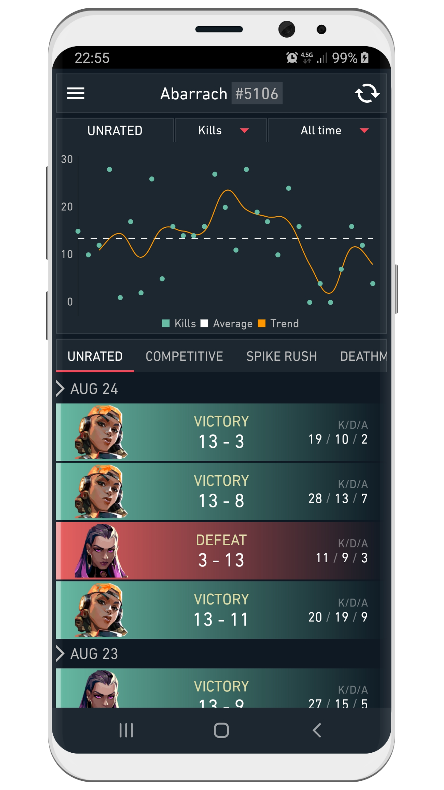
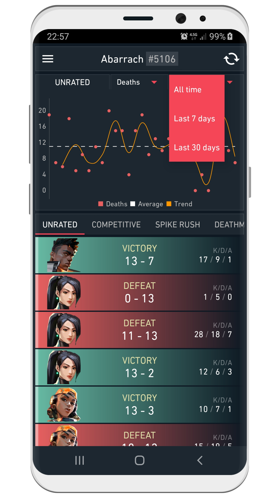
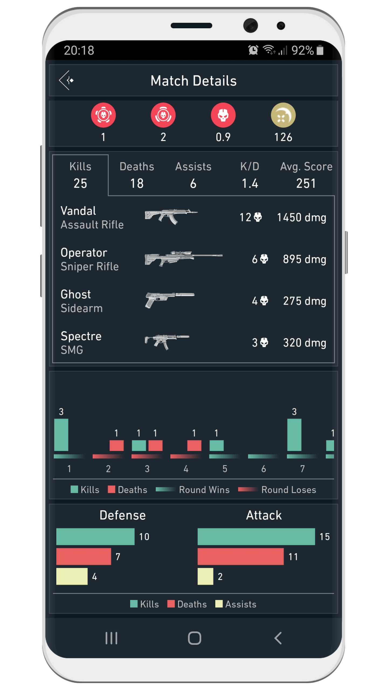

## What is Spike Stats?

Spike Stats for Valorant is a mobile application for iOS & Android that specializes on analyzing players’ performance statistics and displaying them in an easy to understand fashion.

### Performance Graphs

Spike Stats allows players to see their own profile, match history and statistics. It utilizes and interprets the data in the API to create insightful new information such as performance averages and trends. This data is then displayed to players in the form of beautiful graphs that are simple to digest.

[{:height=49%" width="49%"}](screenshots/framed_1.png)
[{:height=49%" width="49%"}](screenshots/framed_2.png)

### Detailed Match Results

Spike Stats also provides detailed information for each individual match players has completed. This includes map info, names & number of medals accumulated during the match, KDA info as well as its breakdowns (such as kills per weapon type), round details and many other data points which we think players would benefit.

[{:height=49%" width="49%"}](screenshots/framed_3.png)
[{:height=49%" width="49%"}](screenshots/framed_4.png)

### Minimalistic UI

Spike Stats is inspired by the minimalistic UI of Valorant and takes design cues from it to recreate the look and feel of the game while adding some characteristic elements of its own.

<iframe src='https://www.youtube.com/embed/QWg4vfqczVI' frameborder='0' allowfullscreen></iframe>

 

### About Us

We are a companion app development group that focuses on bringing high quality and game-enriching third party support to popular games such as Destiny 1 and Destiny 2.
Our apps have been enjoyed more than 2 million players world wide. We always strive to increase the quality of our apps and bring new features.

### Other Apps
* The Vault: Item Manager iOS Android
* Where is Xur? ios Android

### Contact

[E-mail](mailto:crocusgames@gmail.com)
