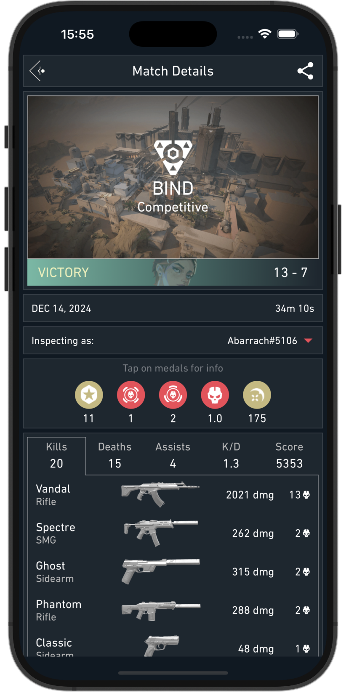
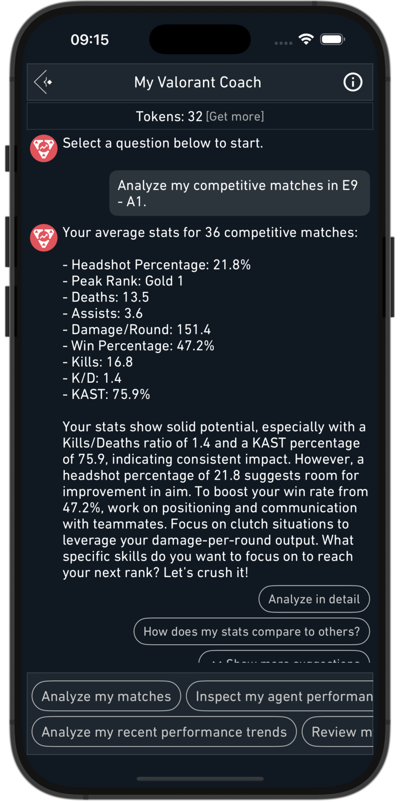
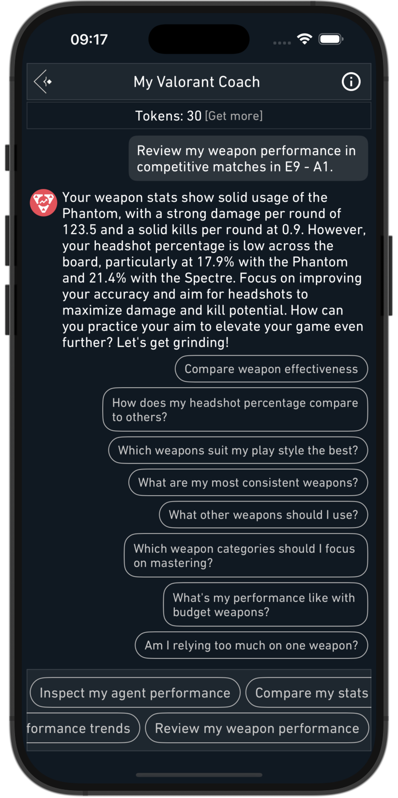
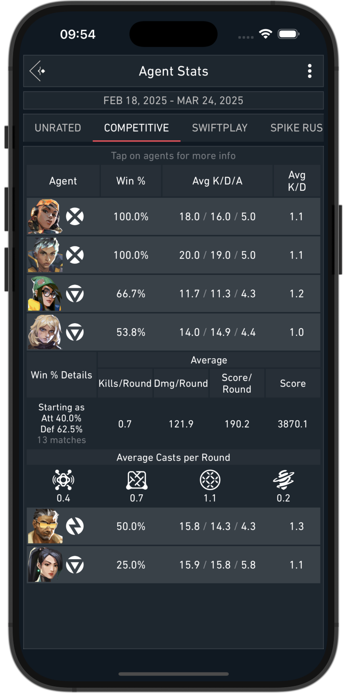
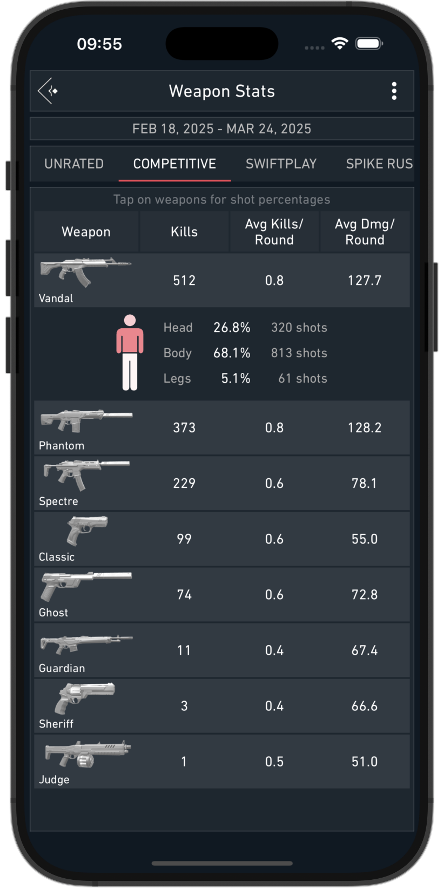
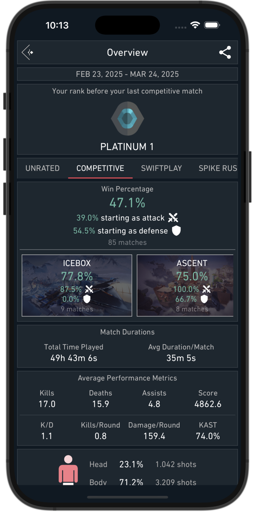
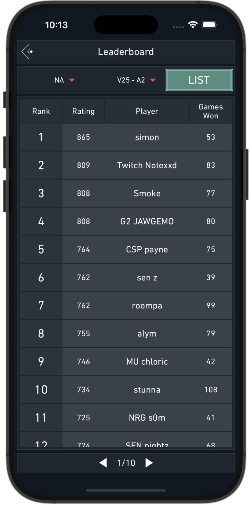
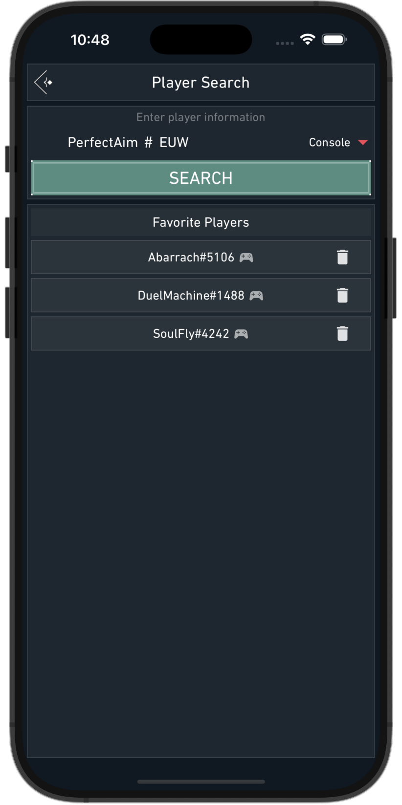
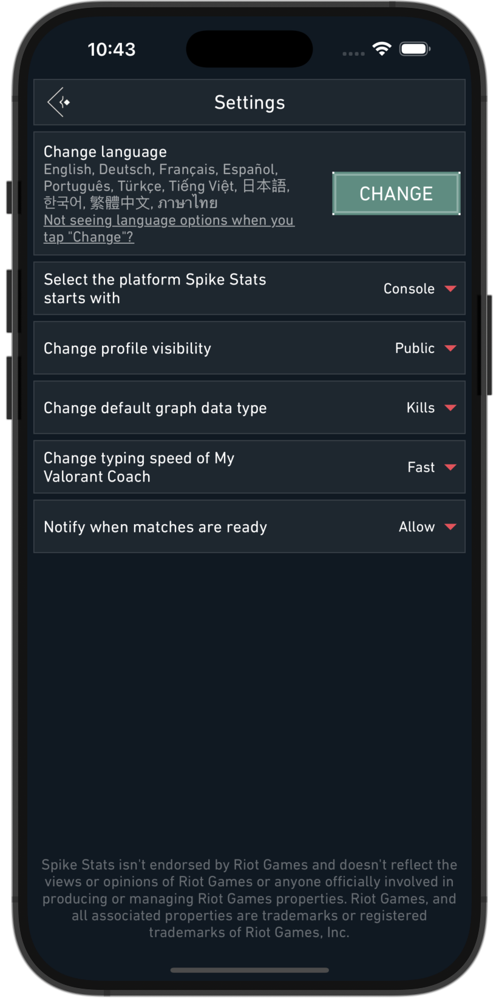

# Spike Stats – Valorant Tracker App for iOS & Android

Spike Stats is a <a href="https://playvalorant.com/" target="_blank">Valorant</a> Tracker app designed specifically for iOS and Android users, providing comprehensive analysis of Valorant player statistics in an easy-to-understand format.

  <a href="/screenshots/spike-stats-sign-in-page.png" target="_blank">
    <picture>
      <source srcset="/screenshots/spike-stats-sign-in-page.webp" type="image/webp">
      
    </picture>
  </a>
  <a href="screenshots/spike-stats-graph-stat-options.png" target="_blank">
    <picture>
      <source srcset="/screenshots/spike-stats-graph-stat-options.webp" type="image/webp">
      
    </picture>
  </a>

## Valorant Performance Tracking with Graphs

Spike Stats helps Valorant players track their profile, match history, and game statistics. Leveraging official Valorant API data, Spike Stats provides insightful metrics, averages, and trends displayed as intuitive graphs to enhance your gameplay. [Explore your Match History & Performance Graphs →](/features/match-history)

  <a href="/screenshots/valorant-tracker-graph-kast.png" target="_blank">
    <picture>
        <source srcset="/screenshots/valorant-tracker-graph-kast.webp" type="image/webp">
        
      </picture>
  </a>

## Detailed Valorant Match Analysis

Spike Stats gives you detailed analytics for every Valorant match you complete, including map details, medals earned, comprehensive KDA breakdowns, kills per weapon type, KAST percentages, round-by-round insights, and more, empowering you to understand and improve your gameplay. [Dive into your Match Details & Round Analysis →](/features/match-analysis)

## Valorant Coach – Your AI-Powered Valorant Assistant

Review your Valorant matches using Spike Stats' personalized Valorant Coach. Get custom gameplay recommendations, analyze your stats deeply, and elevate your skills effectively. [Get personalized insights from the AI Valorant Coach →](/features/valorant-coach)

## Detailed Agent & Weapon Stats

Spike Stats tracks your performance for every Valorant agent, displaying key metrics like win rate and KDA. Easily sort and filter agent stats by role. Additionally, the app records accuracy and effectiveness for all Valorant weapons, including kills, kills per round, damage per round, and shot accuracy, sortable and filterable by weapon type. [View your Agent & Weapon Stats →](/features/agent-weapon-stats)

## Valorant Overview & Leaderboards

Get a quick summary of your recent matches, overall win rates by mode and map, attacker/defender performance, and essential statistics like KDA and KAST. Spike Stats also features comprehensive leaderboards to compare your performance across various Valorant metrics. [Track your Valorant Overview & Leaderboards →](/features/account-overview-leaderboard)

## Player Search & Multi-language Support

Search any Valorant player's stats quickly using their game name and tagline. [Look up Valorant players and track their stats →](/features/player-search)

Spike Stats makes Valorant tracking easy for players worldwide with full localization in 11 languages, including English, German, Spanish, French, Portuguese, Turkish, Thai, Vietnamese, Japanese, Korean, and Traditional Chinese.

## Multi-Platform Valorant Tracker

Spike Stats is available for download on both the Apple App Store and Google Play, making it the ideal Valorant Tracker app for both iOS and Android gamers.

## Is Spike Stats Safe?

Spike Stats uses <a href="https://support-developer.riotgames.com/hc/en-us/articles/22801670382739-RSO-Riot-Sign-On" target="_blank">Riot Sign on (RSO)</a>, Riot Games’ official authentication method. It exclusively accesses data via the official <a href="https://www.riotgames.com/en/DevRel/valorant-api-launch" target="_blank">Valorant API</a>, ensuring your information remains secure and confidential.

## Download Spike Stats – The Best Valorant Tracker

<ul>
  <li>
    <a href="https://apps.apple.com/us/app/spike-stats-for-valorant/id1541123839" target="_blank">Download Spike Stats – Valorant Tracker for iOS
</a>
  </li>
  <li>
    <a href="https://play.google.com/store/apps/details?id=crocusgames.com.spikestats" target="_blank">Download Spike Stats – Valorant Tracker for Android</a>
  </li>
</ul>

## About Us

We specialize in developing high-quality companion apps designed to enrich gaming experiences for popular games like Destiny 2 and Valorant. Our apps have collectively reached thousands of dedicated gamers worldwide.

#### Our Other Apps

<ul>
  <li>
    The Vault: Item Manager –
    <a href="https://apps.apple.com/us/app/vault-manager-for-destiny-2/id1330143510" target="_blank">iOS</a> /
    <a href="https://play.google.com/store/apps/details?id=com.crocusgames.destinyinventorymanager&hl=en" target="_blank">Android</a>
  </li>
  <li>
    Xur Alert –
    <a href="https://apps.apple.com/us/app/where-is-xur-for-destiny-2/id955286784" target="_blank">iOS</a> /
    <a href="https://play.google.com/store/apps/details?id=com.crocusgames.whereisxur&hl=en" target="_blank">Android</a>
  </li>
</ul>

#### Contact Us
<ul>
  <li><a href="https://discord.gg/UEcuWArhny" target="_blank">Join Official Spike Stats Discord Server</a></li>
  <li><a href="https://twitter.com/SpikeStats" target="_blank">Follow on X</a></li>
  <li><a href="mailto:crocusgames@gmail.com" target="_blank">Send an E-mail</a></li>
</ul>

### Legal

Spike Stats isn't endorsed by Riot Games and doesn't reflect the views or opinions of Riot Games or anyone officially involved in producing or managing Riot Games properties. Riot Games, and all associated properties are trademarks or registered trademarks of Riot Games, Inc.
