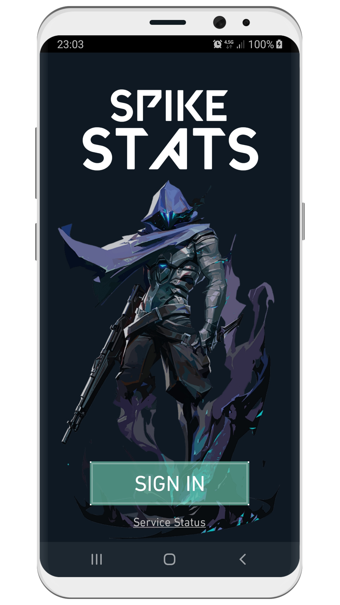
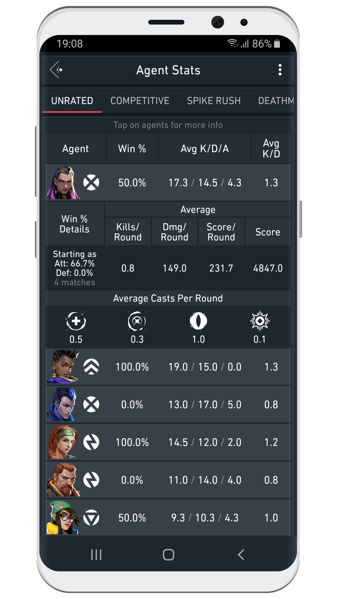
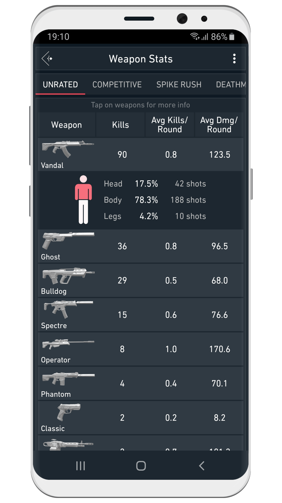
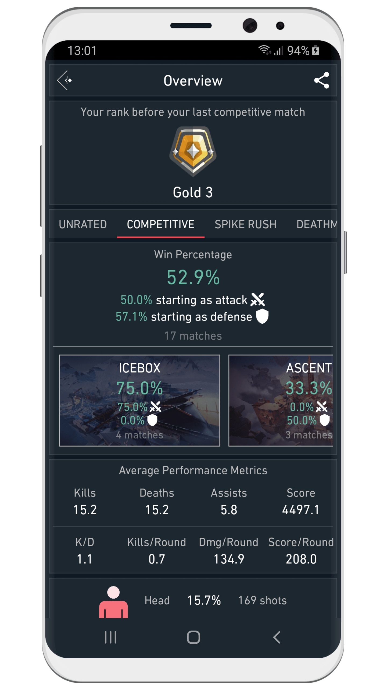
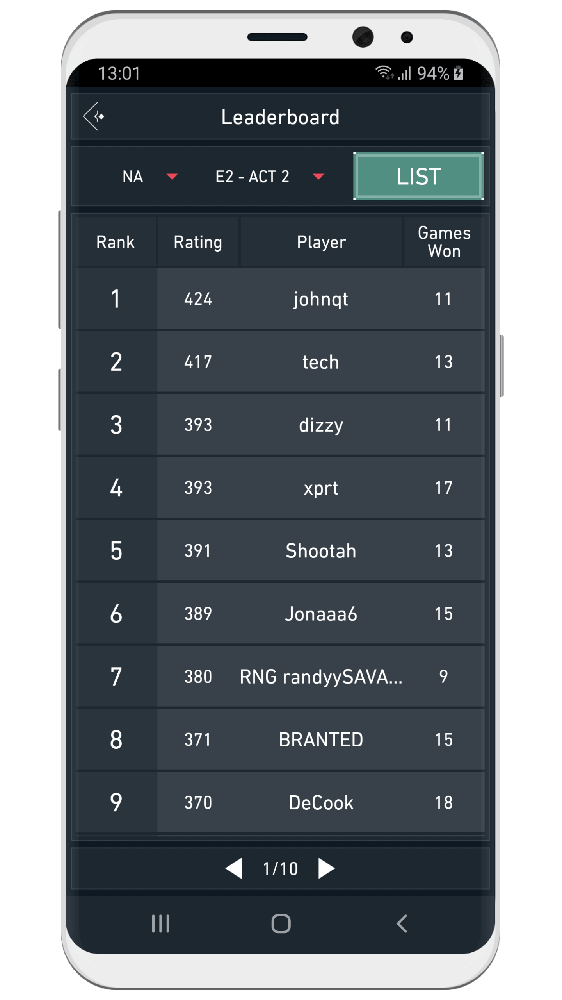

## What is Spike Stats?

Spike Stats for Valorant is a mobile application for iOS & Android that specializes on analyzing players’ performance statistics and displaying them in an easy to understand fashion.

### Performance Graphs

Spike Stats allows players to see their own profile, match history and statistics. It utilizes and interprets the data in the API to create insightful new information such as performance averages and trends. This data is then displayed to players in the form of beautiful graphs that are simple to digest.

[{:height=49%" width="49%"}](screenshots/framed_1.png)
[{:height=49%" width="49%"}](screenshots/framed_2.png)

### Detailed Match Results

Spike Stats also provides detailed information for each individual match players has completed. This includes map info, names & number of medals accumulated during the match, KDA info as well as its breakdowns (such as kills per weapon type), round details and many other data points which we think players would benefit.

[{:height=49%" width="49%"}](screenshots/framed_3.png)
[{:height=49%" width="49%"}](screenshots/framed_4.png)

### Agent & Weapon Stats

Spike Stats tracks players’ performance for every agent and creates a list. It includes data such as win rate, KDA info for each agent the player selects. This list can also be sorted by the mentioned metrics and be filtered by agent roles.

Spike Stats records players’ accuracy and effectiveness for every weapon and prepares a list. This list includes kills, kills per round, damage per round, shot percentages and other info for each weapon the player uses. It can also be sorted by the mentioned stats and filtered by weapon type.

[{:height=49%" width="49%"}](screenshots/framed_7.png)
[{:height=49%" width="49%"}](screenshots/framed_8.png)

### Overview & Leaderboards

Spike Stats creates a summary of players’ progress from their recent matches. This summary includes an overall win rate per game mode, win rate per map, win rate when the user starts the match as an attacker or defender, average performance metrics such as KDA and shot percentages.

Spike Stats lists the leaderboards for current and previous acts of all regions.

[{:height=49%" width="49%"}](screenshots/framed_6.png)
[{:height=49%" width="49%"}](screenshots/framed_9.png)

### Minimalistic UI

Spike Stats is inspired by the minimalistic UI of Valorant and takes design cues from it to recreate the look and feel of the game while adding some characteristic elements of its own.

<iframe src='https://www.youtube.com/embed/MLfuaiLoeZk' frameborder='0' allowfullscreen></iframe>

 

### Download

Spike Stats is available on App Store and Google Play.

### About Us

We are a companion app development group that focuses on bringing high quality and game-enriching third party support to popular games such as Destiny 1 and Destiny 2.

Our apps have been downloaded more than 2.5 million times worldwide. We always strive to increase the quality of our apps and bring new features.

#### Our Other Apps
* The Vault: Item Manager [iOS](https://apps.apple.com/us/app/vault-manager-for-destiny-2/id1330143510) [Android](https://play.google.com/store/apps/details?id=com.crocusgames.destinyinventorymanager&hl=en)
* Where is Xur? [iOS](https://apps.apple.com/us/app/where-is-xur-for-destiny-2/id955286784) [Android](https://play.google.com/store/apps/details?id=com.crocusgames.whereisxur&hl=en)

#### Contact Us
* [Follow on Twitter](https://twitter.com/SpikeStats)
* [Send an E-mail](mailto:crocusgames@gmail.com)

### Legal

Spike Stats isn't endorsed by Riot Games and doesn't reflect the views or opinions of Riot Games or anyone officially involved in producing or managing Riot Games properties. Riot Games, and all associated properties are trademarks or registered trademarks of Riot Games, Inc.
